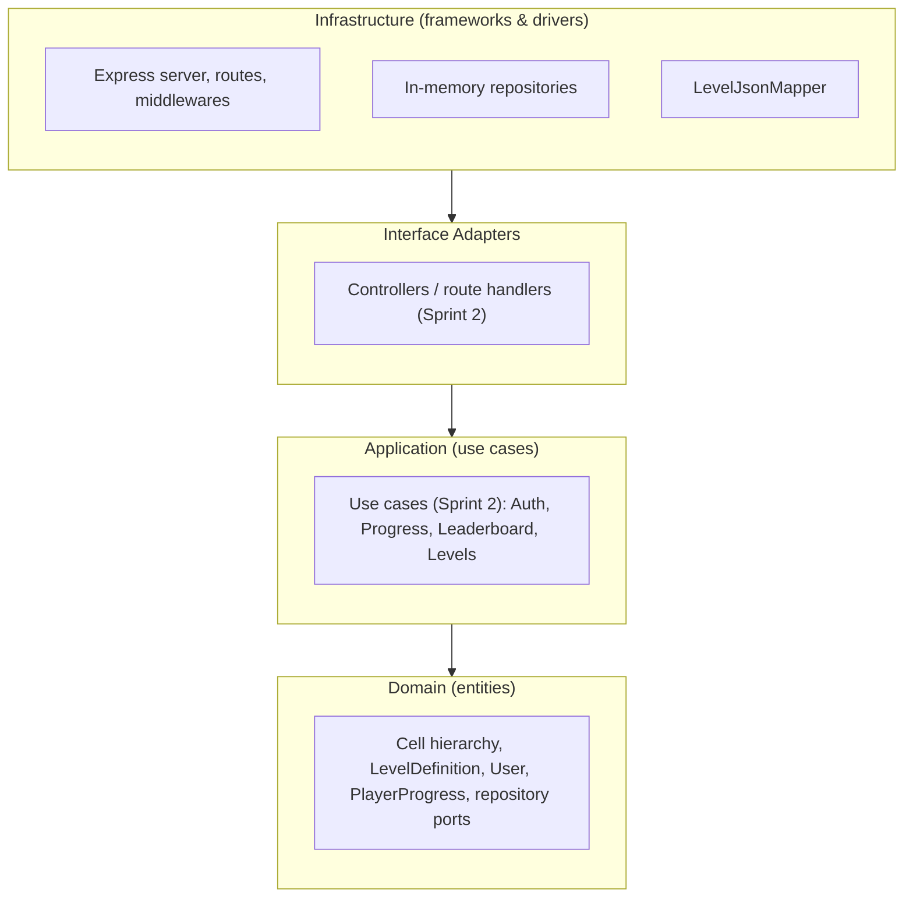

# Arrow Maze — Backend


## Description

REST API backend for **Arrow Maze**, a puzzle game where the player extracts arrows
from a board by moving them in the direction they point, without collisions. This
repository owns level definitions, user accounts, player progress and the global
leaderboard, following **Clean Architecture** and **SOLID** principles.

As of Sprint 1, the domain layer (Week 1) and the HTTP/Express foundations (Sprint 1)
are in place. Authentication, the `/progress`, `/leaderboard` and `/levels` endpoints,
and full AOP coverage are Sprint 2 work — see [Sprint 1 status](#sprint-1-status) below.

## Architecture

Four Clean Architecture layers, dependencies pointing inward (outer layers depend on
inner ones, never the reverse):



Source: [`docs/architecture/clean-architecture.mmd`](docs/architecture/clean-architecture.mmd)
(placeholder for Sprint 1 — will be refined into a full diagram, including ports/adapters
detail, by Sprint 3).

| Layer | Responsibility | Status |
|---|---|---|
| **Domain** | Entities, value objects, factories, repository interfaces (ports) | ✅ Implemented (Week 1) |
| **Application** | Use cases (auth, progress, leaderboard, levels) | 🔜 Sprint 2 |
| **Interface Adapters** | Controllers translating HTTP ↔ use cases | 🔜 Sprint 2 |
| **Infrastructure** | Express server, AOP middlewares, in-memory repositories, `LevelJsonMapper` | ✅ Implemented (Sprint 1) |

### Domain layer

```
src/domain/
├── entities/       # Cell (abstract), ArrowCell, WallCell, EmptyCell, ExitCell,
│                   # BoardComponent/BoardGroup (Composite), LevelDefinition, User, PlayerProgress
├── value-objects/  # Direction, Position
├── factories/       # CellFactory (Factory Method)
├── builders/        # LevelBuilder (Builder)
├── rules/           # BaseLevelProcessor (Template Method)
└── repositories/    # ILevelRepository, IUserRepository, IProgressRepository (ports)
```

### Contract with the frontend

Level definitions are exchanged with the [Arrow-Maze-Escape-Puzzle](https://github.com/Mianjoy/Arrow-Maze-Escape-Puzzle)
frontend using the shared `StructuredLevelJsonDto` contract:
[`docs/contract/level.contract.ts`](docs/contract/level.contract.ts). `LevelJsonMapper`
(`src/infrastructure/mappers/LevelJsonMapper.ts`) translates it into a `LevelDefinition`
using the existing `LevelBuilder`/`CellFactory`.

## Design Patterns

| Pattern | Category | Where |
|---|---|---|
| **Factory Method** | Creational | `CellFactory.createCell()` |
| **Builder** | Creational | `LevelBuilder` |
| **Composite** | Structural | `BoardComponent` / `BoardGroup` |
| **Strategy** | Behavioral | `IScoreStrategy` (used by `LevelDefinition.calculateScore`) |
| **Template Method** | Behavioral | `BaseLevelProcessor.processAction()` |
| **Repository** | Structural (DIP) | `ILevelRepository`, `IUserRepository`, `IProgressRepository` |

## SOLID Principles

- **SRP** — each cell subclass (`ArrowCell`, `WallCell`, `EmptyCell`, `ExitCell`) only
  models its own shape; `LevelJsonMapper` only translates the wire contract, it doesn't
  build HTTP responses or validate business rules.
- **OCP** — new cell types extend `Cell`/`BoardComponent` without changing existing
  subclasses; new use cases can be added under `application/` without touching `domain/`.
- **LSP** — every `Cell` subclass can be used wherever a `Cell` is expected (see
  `CellFactory.createCell(): Cell`).
- **ISP** — repository ports (`ILevelRepository`, `IUserRepository`, `IProgressRepository`)
  are split by aggregate instead of one large repository interface.
- **DIP** — `LevelJsonMapper` and future use cases depend on `I*Repository` interfaces,
  not on the concrete `InMemory*Repository` implementations; the composition root
  (`src/main.ts`) is the only place that wires concrete classes.

## AOP

Cross-cutting concerns are implemented as Express middlewares, registered once in
`src/infrastructure/http/server.ts` so every route (including Sprint 2 endpoints)
gets them for free:

1. **Logging** — `requestLoggerMiddleware` logs method, path, status code and duration
   for every request.
2. **Centralized exception handling** — `errorHandlerMiddleware` turns any unhandled
   error into a consistent JSON error response, instead of each controller repeating
   its own try/catch.
3. *(Sprint 2)* — an authorization aspect (guarding routes that require a valid JWT)
   will be added once `/auth` exists, completing the 3 required aspects.

## Getting Started

```bash
npm install
cp .env.example .env
npm run dev      # starts the Express server (default: http://localhost:3000)
```

`GET /health` should respond `{ "status": "ok" }`. Interactive API docs (Swagger UI)
are served at `/docs`.

## Running Tests

```bash
npm test    # Jest: unit + integration tests, with coverage
npm run lint
npm run build
```

Current test suite: `tests/unit/domain/ArrowCell.spec.ts` (domain unit test),
`tests/unit/infrastructure/LevelJsonMapper.spec.ts` (contract-to-domain mapping),
`tests/integration/health.spec.ts` (supertest integration test for `GET /health`).
CI (`.github/workflows/ci.yml`) runs lint, build and test on every PR/push to `main`.

## AI Usage Documentation

See [AI_USAGE.md](AI_USAGE.md) for the full log of AI-assisted tasks (tool, prompt,
result, team adjustments, lessons learned).

## Sprint 1 status

- ✅ Domain layer (Week 1): cell hierarchy, `LevelDefinition`, `User`, `PlayerProgress`,
  repository ports.
- ✅ Express + TypeScript scaffolding, 2 of 3 AOP aspects, Swagger UI, `GET /health`.
- ✅ In-memory repositories for all three ports.
- ✅ Shared level contract (`level.contract.ts`) + `LevelJsonMapper` (tested against the
  team's `simple-1` example level).
- ✅ CI (lint + build + test) on every PR.
- 🔜 Sprint 2: JWT auth, `/progress`, `/leaderboard`, `/levels` endpoints, use cases,
  third AOP aspect, concrete persistence.

## Contributing

1. Create a branch off `main` (e.g. `feature/<short-description>`).
2. Follow [Conventional Commits](https://www.conventionalcommits.org/) for commit
   messages (enforced via `commitlint` + `husky`).
3. Run `npm run lint && npm run build && npm test` before opening a PR.
4. Open a PR against `main`; CI must pass and at least one teammate must approve
   before merging.

## License

Academic project for Desarrollo de Software (UCAB). No license has been chosen yet;
all rights reserved by the team until one is added.
