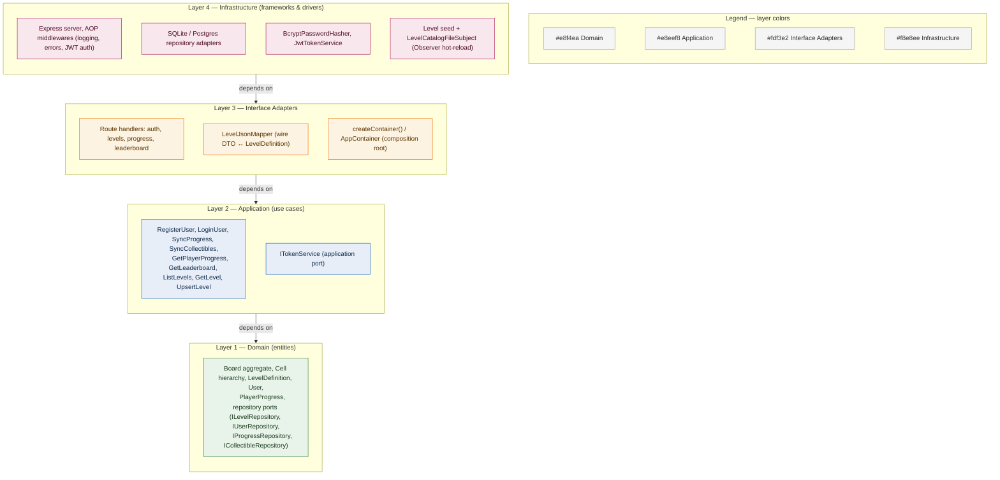
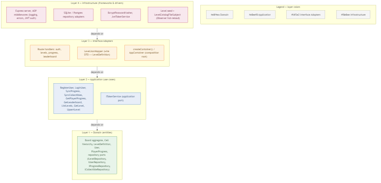
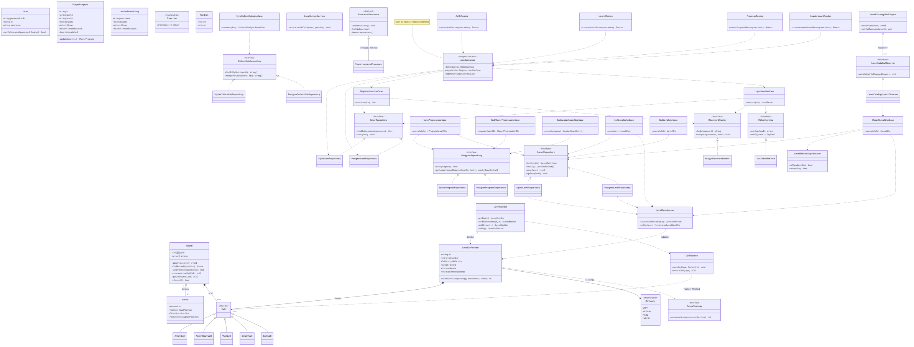

# Arrow Maze — Backend


## Description

REST API backend for **Arrow Maze**, a puzzle game where the player extracts arrows
from a board by moving them in the direction they point, without collisions. This
repository owns level definitions, user accounts, player progress and the global
leaderboard, following **Clean Architecture** and **SOLID** principles.

All four layers are implemented and covered by tests: JWT authentication, level
CRUD with solvability validation, bidirectional progress sync (push on victory,
pull on login), collectible unlock sync, a global leaderboard, and persistence
(SQLite or Postgres) that survives process restarts.

## Architecture

Four Clean Architecture layers, dependencies pointing inward (outer layers depend on
inner ones, never the reverse):





Source: [`docs/architecture/clean-architecture.mmd`](docs/architecture/clean-architecture.mmd) (editable). Regenerate README embeds with `python scripts/sync-readme-diagrams.py`.

| Layer | Responsibility | Status |
|---|---|---|
| **Domain** | Entities, value objects, factories, repository interfaces (ports) | ✅ Implemented |
| **Application** | Use cases: auth, progress sync (push + pull), leaderboard, levels | ✅ Implemented |
| **Interface Adapters** | Route handlers translating HTTP ↔ use cases, `LevelJsonMapper` | ✅ Implemented |
| **Infrastructure** | Express server, AOP middlewares, SQLite/Postgres repositories, catalog seed (Observer) | ✅ Implemented |

### Domain layer

```
src/domain/
├── aggregates/      # Board (the only active Aggregate Root for gameplay)
├── entities/        # ArrowCell, WallCell, EmptyCell, ExitCell, LevelDefinition, User, PlayerProgress
├── value-objects/   # Direction, Position, LeaderBoardEntry
├── factories/        # CellFactory (Factory Method)
├── builders/         # LevelBuilder (Builder)
├── services/         # LevelSolvabilityValidator, LevelActionService, LevelToBoardMapper
├── rules/            # BaseLevelProcessor (Template Method), FireArrowLevelProcessor
├── repositories/     # ILevelRepository, IUserRepository, IProgressRepository, ICollectibleRepository (ports)
└── tests/            # BoardTestBuilder, BoardObjectMother, BoardTestingApi (test-only helpers)
```

### Contract with the frontend

Level definitions are exchanged with the [Arrow-Maze-Escape-Puzzle](https://github.com/Mianjoy/Arrow-Maze-Escape-Puzzle)
frontend using the shared `StructuredLevelJsonDto` contract:
[`docs/contract/level.contract.ts`](docs/contract/level.contract.ts). `LevelJsonMapper`
(`src/infrastructure/mappers/LevelJsonMapper.ts`) translates it into a `LevelDefinition`
using the existing `LevelBuilder`/`CellFactory`, and validates solvability
(`LevelSolvabilityValidator`) before a level can be persisted.

### Class Diagram

Main classes across all four layers (color-coded), their relationships
(inheritance, interface implementation, association/composition), and the
design patterns applied. Low-level test helpers are omitted for readability.
Editable source: [`docs/architecture/class-diagram.mmd`](docs/architecture/class-diagram.mmd). Regenerate README embeds with `python scripts/sync-readme-diagrams.py`.

```mermaid
classDiagram
    direction TB

    %% Arrow Maze Backend — Class Diagram
    %% Layer colors: green=Domain, blue=Application, orange=Adapters, pink=Infrastructure
    %% Patterns: Factory Method, Builder, Template Method, Strategy, Adapter,
    %% Repository/DIP, Observer (catalog hot-reload)

    %% ----- Domain: Board aggregate & cell hierarchy -----
    class Cell {
        <<abstract>>
    }
    class ArrowCell
    class ArrowBodyCell
    class WallCell
    class EmptyCell
    class ExitCell
    Cell <|-- ArrowCell
    Cell <|-- ArrowBodyCell
    Cell <|-- WallCell
    Cell <|-- EmptyCell
    Cell <|-- ExitCell

    class Board {
        -Cell[][] grid
        -Arrow[] arrows
        +addArrow(arrow) void
        +findArrowAt(position) Arrow
        +clearPositions(positions) void
        +removeArrowById(id) void
        +getCellAt(row, col) Cell
        +isSolved() bool
    }
    class Arrow {
        +ArrowId id
        +Position headPosition
        +Direction direction
        +Position[] occupiedPositions
    }
    Board "1" o-- "0..*" Arrow : arrows
    Board "1" *-- "many" Cell : grid

    class Difficulty {
        <<enumeration>>
        EASY
        MEDIUM
        HARD
        EXPERT
    }
    class LevelDefinition {
        +string id
        +int levelNumber
        +Difficulty difficulty
        +Cell[][] board
        +int maxMoves
        +int maxTimeInSeconds
        +calculateScore(strategy, movements, time) int
    }
    LevelDefinition "1" *-- "many" Cell : board
    LevelDefinition --> Difficulty

    class IScoreStrategy {
        <<interface>>
        +calculateScore(movements, time) int
    }
    LevelDefinition ..> IScoreStrategy : Strategy

    class User {
        -string passwordHash
        +string id
        +string username
        +verifyPassword(password, hasher) bool
    }
    class PlayerProgress {
        +string id
        +string userId
        +string levelId
        +int highScore
        +int minMoves
        +int minTimeInSeconds
        +bool isCompleted
        +updateScore(...) PlayerProgress
    }
    class LeaderBoardEntry {
        +string username
        +int highScore
        +int minMoves
        +int minTimeInSeconds
    }
    class Direction {
        <<enumeration>>
        UP DOWN LEFT RIGHT
    }
    class Position {
        +int row
        +int col
    }

    class ILevelRepository {
        <<interface>>
        +findById(id) LevelDefinition
        +listAll() LevelDefinition[]
        +save(level) void
        +update(level) void
    }
    class IUserRepository {
        <<interface>>
        +findByUsername(username) User
        +save(user) void
    }
    class IProgressRepository {
        <<interface>>
        +save(progress) void
        +getLeaderboardByLevel(levelId, limit) LeaderBoardEntry[]
    }
    class ICollectibleRepository {
        <<interface>>
        +findAllByUser(userId) string[]
        +mergeForUser(userId, ids) string[]
    }
    class IPasswordHasher {
        <<interface>>
        +hash(password) string
        +compare(password, hash) bool
    }

    class CellFactory {
        +register(type, factoryFn) void
        +createCell(type) Cell
    }
    CellFactory ..> Cell : Factory Method

    class LevelBuilder {
        +withId(id) LevelBuilder
        +withDimensions(h, w) LevelBuilder
        +addArrow(...) LevelBuilder
        +build() LevelDefinition
    }
    LevelBuilder ..> LevelDefinition : Builder
    LevelBuilder ..> CellFactory

    class BaseLevelProcessor {
        <<abstract>>
        +processAction() void
        #validateAction()*
        #executeMovement()*
    }
    class FireArrowLevelProcessor
    BaseLevelProcessor <|-- FireArrowLevelProcessor : Template Method

    class LevelSolvabilityValidator {
        +isPlayable(dto) bool
        +solve(dto) bool
    }
    class LevelActionService {
        +interactWithCell(board, position) void
    }

    %% ----- Application -----
    class ITokenService {
        <<interface>>
        +sign(payload) string
        +verify(token) Payload
    }

    class RegisterUserUseCase { +execute(dto) User }
    class LoginUserUseCase { +execute(dto) AuthResult }
    class SyncProgressUseCase { +execute(dto) ProgressResultDto }
    class SyncCollectiblesUseCase { +execute(dto) CollectiblesSyncResultDto }
    class GetPlayerProgressUseCase { +execute(userId) PlayerProgressListDto }
    class GetLeaderboardUseCase { +execute(query) LeaderBoardEntry[] }
    class ListLevelsUseCase { +execute() LevelDto[] }
    class GetLevelUseCase { +execute(id) LevelDto }
    class UpsertLevelUseCase { +execute(dto) LevelDto }

    RegisterUserUseCase ..> IUserRepository
    RegisterUserUseCase ..> IPasswordHasher
    LoginUserUseCase ..> IUserRepository
    LoginUserUseCase ..> IPasswordHasher
    LoginUserUseCase ..> ITokenService
    SyncProgressUseCase ..> IProgressRepository
    SyncProgressUseCase ..> ILevelRepository
    SyncCollectiblesUseCase ..> ICollectibleRepository
    GetPlayerProgressUseCase ..> IProgressRepository
    GetLeaderboardUseCase ..> IProgressRepository
    ListLevelsUseCase ..> ILevelRepository
    GetLevelUseCase ..> ILevelRepository
    UpsertLevelUseCase ..> ILevelRepository
    UpsertLevelUseCase ..> LevelSolvabilityValidator

    %% ----- Interface Adapters -----
    class LevelJsonMapper {
        +toLevelDefinition(dto) LevelDefinition
        +toDto(level) StructuredLevelJsonDto
    }
    ListLevelsUseCase ..> LevelJsonMapper
    UpsertLevelUseCase ..> LevelJsonMapper
    LevelJsonMapper ..> LevelDefinition : Adapter

    class AppContainer {
        <<composition root>>
        +tokenService ITokenService
        +registerUser RegisterUserUseCase
        +loginUser LoginUserUseCase
    }
    note for AppContainer "Built by async createContainer()"

    class AuthRoutes { +createAuthRouter(container) Router }
    class LevelsRoutes { +createLevelsRouter(container) Router }
    class ProgressRoutes { +createProgressRouter(container) Router }
    class LeaderboardRoutes { +createLeaderboardRouter(container) Router }
    AuthRoutes ..> AppContainer
    LevelsRoutes ..> AppContainer
    ProgressRoutes ..> AppContainer
    LeaderboardRoutes ..> AppContainer

    %% ----- Infrastructure: persistence adapters -----
    class SqliteUserRepository
    class SqliteLevelRepository
    class SqliteProgressRepository
    class SqliteCollectibleRepository
    class PostgresUserRepository
    class PostgresLevelRepository
    class PostgresProgressRepository
    class PostgresCollectibleRepository
    class BcryptPasswordHasher
    class JwtTokenService

    IUserRepository <|.. SqliteUserRepository
    IUserRepository <|.. PostgresUserRepository
    ILevelRepository <|.. SqliteLevelRepository
    ILevelRepository <|.. PostgresLevelRepository
    IProgressRepository <|.. SqliteProgressRepository
    IProgressRepository <|.. PostgresProgressRepository
    ICollectibleRepository <|.. SqliteCollectibleRepository
    ICollectibleRepository <|.. PostgresCollectibleRepository
    IPasswordHasher <|.. BcryptPasswordHasher
    ITokenService <|.. JwtTokenService
    SqliteLevelRepository ..> LevelJsonMapper
    PostgresLevelRepository ..> LevelJsonMapper

    AppContainer ..> SqliteUserRepository
    AppContainer ..> PostgresUserRepository
    AppContainer ..> RegisterUserUseCase
    AppContainer ..> LoginUserUseCase

    %% ----- Infrastructure: Observer (catalog hot-reload) -----
    class ILevelCatalogObserver {
        <<interface>>
        +onCatalogFileChanged(event) void
    }
    class LevelCatalogFileSubject {
        +attach(observer) void
        +notifyObservers(event) void
    }
    class LevelCatalogUpsertObserver
    ILevelCatalogObserver <|.. LevelCatalogUpsertObserver
    LevelCatalogFileSubject o-- "0..*" ILevelCatalogObserver : Observer
    LevelCatalogUpsertObserver ..> UpsertLevelUseCase

    %% ----- Layer legend -----
    classDef domain fill:#e8f4ea,stroke:#2e7d32,color:#1b3a1e
    classDef application fill:#e8eef8,stroke:#1565c0,color:#0d2a4d
    classDef adapters fill:#fdf3e2,stroke:#ef6c00,color:#5c3600
    classDef infrastructure fill:#f8e8ee,stroke:#ad1457,color:#4d0d24

    cssClass "Cell,ArrowCell,ArrowBodyCell,WallCell,EmptyCell,ExitCell,Board,Arrow,Difficulty,LevelDefinition,IScoreStrategy,User,PlayerProgress,LeaderBoardEntry,Direction,Position,ILevelRepository,IUserRepository,IProgressRepository,ICollectibleRepository,IPasswordHasher,CellFactory,LevelBuilder,BaseLevelProcessor,FireArrowLevelProcessor,LevelSolvabilityValidator,LevelActionService" domain
    cssClass "ITokenService,RegisterUserUseCase,LoginUserUseCase,SyncProgressUseCase,SyncCollectiblesUseCase,GetPlayerProgressUseCase,GetLeaderboardUseCase,ListLevelsUseCase,GetLevelUseCase,UpsertLevelUseCase" application
    cssClass "LevelJsonMapper,AppContainer,AuthRoutes,LevelsRoutes,ProgressRoutes,LeaderboardRoutes" adapters
    cssClass "SqliteUserRepository,SqliteLevelRepository,SqliteProgressRepository,SqliteCollectibleRepository,PostgresUserRepository,PostgresLevelRepository,PostgresProgressRepository,PostgresCollectibleRepository,BcryptPasswordHasher,JwtTokenService,ILevelCatalogObserver,LevelCatalogFileSubject,LevelCatalogUpsertObserver" infrastructure
```





## Design Patterns

| Pattern | Category | Where | Why |
|---|---|---|---|
| **Factory Method** | Creational | [`CellFactory.createCell()`](src/domain/factories/CellFactory.ts) | New cell types register themselves without the caller ever instantiating a concrete class |
| **Builder** | Creational | [`LevelBuilder`](src/domain/builders/LevelBuilder.ts) | Assembles a `LevelDefinition` step by step (dimensions, cells, arrows, constraints) from a JSON/YAML-style source |
| **Adapter** | Structural | [`LevelJsonMapper`](src/infrastructure/mappers/LevelJsonMapper.ts) | Translates the external wire contract (`StructuredLevelJsonDto`) to/from the internal `LevelDefinition` aggregate, isolating domain from transport format |
| **Repository (DIP)** | Structural | [`ILevelRepository`](src/domain/repositories/ILevelRepository.ts), `IUserRepository`, `IProgressRepository` | Use cases depend on these ports, never on the concrete SQLite implementations |
| **Strategy** | Behavioral | [`IScoreStrategy`](src/domain/entities/LevelDefinition.ts) (used by `LevelDefinition.calculateScore`) | Swappable scoring algorithm without touching `LevelDefinition` |
| **Template Method** | Behavioral | [`BaseLevelProcessor.processAction()`](src/domain/rules/BaseLevelProcessor.ts) | Fixes the step order (validate → execute → score → check win); `FireArrowLevelProcessor` fills in the concrete steps |
| **Observer** | Behavioral | [`LevelCatalogFileSubject`](src/infrastructure/persistence/seed/observers/LevelCatalogFileSubject.ts) + [`LevelCatalogUpsertObserver`](src/infrastructure/persistence/seed/observers/LevelCatalogUpsertObserver.ts) | Hot-reloads `levels/*.json` into the server catalog without restarting the process |

## SOLID Principles

- **SRP** — [`RegisterUserUseCase`](src/application/use-cases/RegisterUserUseCase.ts) only
  orchestrates registration (check uniqueness, hash password, persist); it doesn't know
  about HTTP status codes or JWT — that's `auth.routes.ts` and `JwtTokenService`'s job:
  ```ts
  export class RegisterUserUseCase {
    constructor(
      private readonly userRepository: IUserRepository,
      private readonly passwordHasher: IPasswordHasher,
    ) {}

    public async execute(dto: RegisterUserDto): Promise<User> {
      const existing = await this.userRepository.findByUsername(dto.username);
      if (existing) throw new UserAlreadyExistsError(dto.username);
      const passwordHash = await this.passwordHasher.hash(dto.password);
      const user = new User(randomUUID(), dto.username, passwordHash, new Date());
      await this.userRepository.save(user);
      return user;
    }
  }
  ```
- **OCP** — [`CellFactory`](src/domain/factories/CellFactory.ts) exposes `.register()`;
  adding a new cell type means calling that method somewhere else, never editing the
  factory's internals.
- **LSP** — every `Cell` subclass (`ArrowCell`, `WallCell`, `EmptyCell`, `ExitCell`) can be
  used anywhere a `Cell` is expected (`CellFactory.createCell(): Cell`), with no subclass
  narrowing the contract.
- **ISP** — repository ports are split by aggregate (`ILevelRepository`, `IUserRepository`,
  `IProgressRepository`) instead of one large repository interface — no implementation is
  forced to satisfy methods it doesn't need.
- **DIP** — see the `RegisterUserUseCase` snippet above: it depends on `IUserRepository`/
  `IPasswordHasher` interfaces, never on `SqliteUserRepository`/`BcryptPasswordHasher`
  directly. The composition root ([`src/infrastructure/http/container.ts`](src/infrastructure/http/container.ts))
  is the only place that wires concrete classes — swapping SQLite for another database
  means changing that one file, not the use cases.

## AOP

Cross-cutting concerns are implemented as Express middlewares, registered once in
[`src/infrastructure/http/server.ts`](src/infrastructure/http/server.ts) so every route
gets them for free, without any use case importing a logger or an auth check itself:

1. **Logging** — [`requestLoggerMiddleware`](src/infrastructure/http/middlewares/requestLogger.middleware.ts)
   logs method, path, status code and duration for every request.
2. **Centralized exception handling** — [`errorHandlerMiddleware`](src/infrastructure/http/middlewares/errorHandler.middleware.ts)
   turns any `ApplicationError` (or unexpected error) into a consistent JSON error
   response, instead of each route handler repeating its own try/catch.
3. **Authorization** — [`auth.middleware.ts`](src/infrastructure/http/middlewares/auth.middleware.ts)
   verifies the JWT and attaches `req.auth` before protected routes run (`POST
   /progress/sync`, `GET /progress`, `PUT /levels/:id`); public routes (`GET /levels`,
   `/auth/*`, `/health`) skip it entirely.

## Getting Started

```bash
npm install
cp .env.example .env
npm run dev      # starts the Express server (default: http://localhost:3000)
```

`GET /health` should respond `{ "status": "ok" }`. Interactive API docs (Swagger UI)
are served at `/docs`. Data persists to `data/arrowmaze.db` (SQLite) by default — set
`DB_PATH` in `.env` to change the location, or `:memory:` for an ephemeral run.

## Running Tests

```bash
npm test    # Jest: unit + integration tests, with coverage
npm run lint
npm run build
```

The suite covers all four layers: domain unit tests (`tests/unit/domain/`), use-case
unit tests with mocked repositories (`tests/unit/application/`), HTTP integration tests
with supertest (`tests/integration/`, including auth, levels, progress/leaderboard, and
SQLite persistence across simulated process restarts), and an end-to-end catalog
playability test (`tests/e2e/`). CI (`.github/workflows/ci.yml`) runs lint, build, test
(`--maxWorkers=2`, to match the runner's 2 vCPUs and avoid the level-catalog seeding in
several integration tests starving other parallel workers of CPU) and a final step that
verifies the shared contract fixtures under `docs/contract/fixtures/` are still in sync
with the frontend repo (`scripts/check-contract-fixtures-sync.sh`), on every PR/push to
`main` and `develop`.

## AI Usage Documentation

See [AI_USAGE.md](AI_USAGE.md) for the full log of AI-assisted tasks (tool, prompt,
result, team adjustments, lessons learned).

## Contributing

1. Create a branch off `main` (e.g. `feature/<short-description>`).
2. Follow [Conventional Commits](https://www.conventionalcommits.org/) for commit
   messages (enforced via `commitlint` + `husky`).
3. Run `npm run lint && npm run build && npm test` before opening a PR.
4. Open a PR against `main`; CI must pass and at least one teammate must approve
   before merging.

## License

Academic project for Desarrollo de Software (UCAB). No license has been chosen yet;
all rights reserved by the team until one is added.
